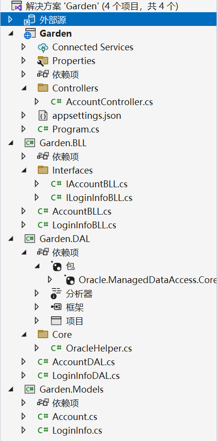
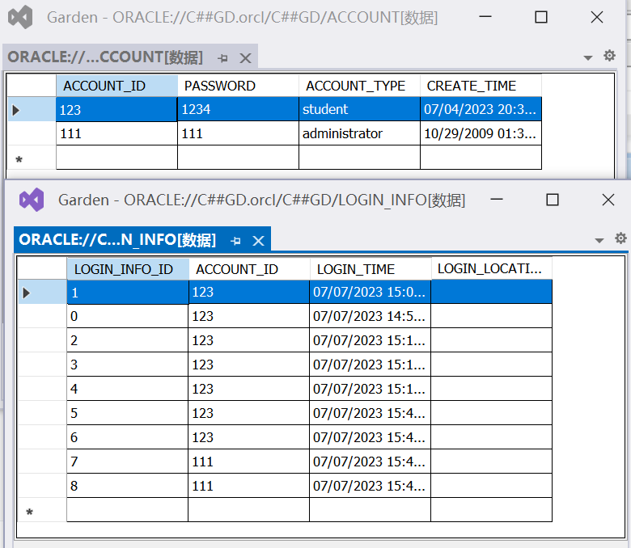
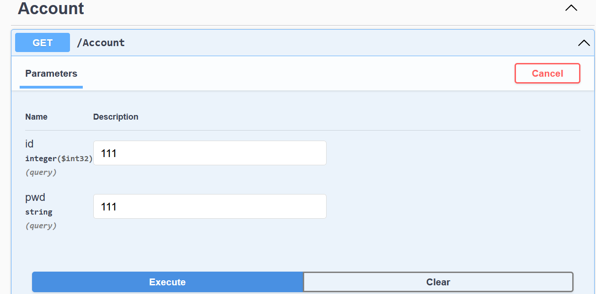
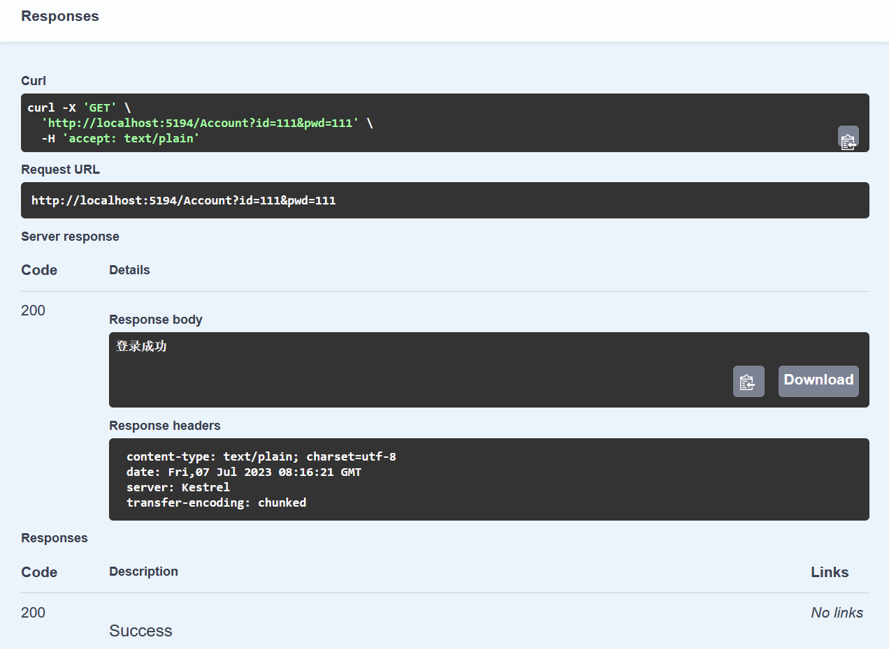
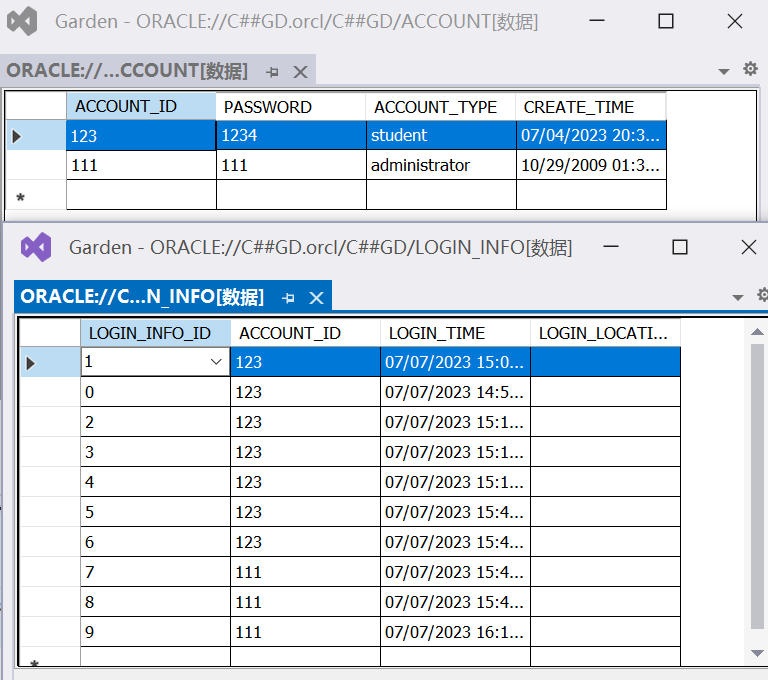

文件夹中右键/使用Visual Studio打开→双击Garden.sln→运行

### 当前进度

需要对于每张表建立Model，以及三层架构中的BLL和DAL。

登录功能，涉及到Account和Login_info两张表：



`Garden.DAL/Core/OracleHelper.cs`中对连接Oracle进行了封装

在`Garden/Controllers/AccountController.cs`中实现了简单的登录(GET操作，传入int型ID和string型密码，返回string；查询是否存在该用户，如果存在则登录成功并记录登录信息)：

```c#
[HttpGet]
public ActionResult<string> Get(int id, string pwd) 
{
    return _accountBLL.Login(id, pwd);

}
```

### 测试

测试数据：





刷新后Login_info添加一行数据：