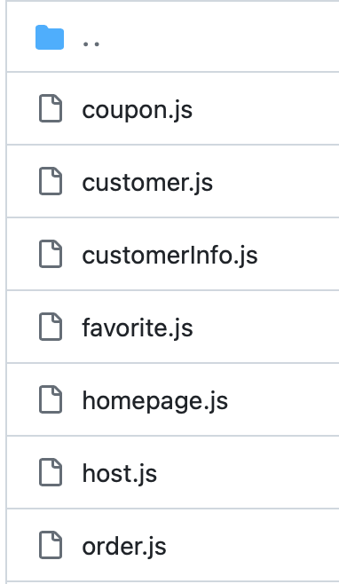

# 8.2 更新

鉴于主要功能页面的前端搭建基本完毕，这次开始要打通数据交换。

负责前端的同学继续负责之前编写的前端页面的数据请求代码，负责后端的同学逐步搭建后端三层架构。具体如下：

### 前端数据请求

src/api/目录下编写数据请求API，其具体内涵外延自行上网学习。目前我们只有一个basicApi.js作为demo，实际开发我们要进行划分，类似于components组件，例如对于一个博客的相关数据请求应该有一个js文件，前端vue文件的\<script>里按需对API进行导入、使用。

我们的项目中components/LoginCard.vue有通过API请求数据的例子，但未进行划分，使用的是basicApi.js，主要参考setup()方法中的代码；components/BlogBlock.vue里有methods方法的示例，但未进行数据请求。

下面是src/api/目录文件划分的一个例子：



下面是该例子中order.js文件的内容，定义了各个API组件的方法，并使用request进行数据请求：

```js
import request from '@/utils/request'


export function GetHostOrderInfo() {
    return request({
        url: '/order/HostOrderInfo',
        method: 'get'
    })
}

export function GetCustomerOrderInfo() {
    return request({
        url: '/order/CustomerOrderInfo',
        method: 'get'
    })
}

export function AddCustomerComment(data1,data2,data3) {
    let param=new URLSearchParams({orderId:data1,commentStars:data2,commentText:data3})
    return request({
        url: '/order/addCustomerComment',
        method: 'post',
        data: param
    })
}

export function AddHostComment(data1,data2,data3) {
    let param=new URLSearchParams({orderId:data1,commentStars:data2,commentText:data3})
    return request({
        url: '/order/addHostComment',
        method: 'post',
        data: param
    })
}

export function ReportCustomerOrder(data1,data2) {
    let param=new URLSearchParams({orderId:data1,reportReason:data2})
    return request({
        url: '/order/reportCustomerOrder',
        method: 'post',
        data: param
    })
}

export function addOrder(data){
    let param = new URLSearchParams(data);
    return request({
        url: '/order/addOrder',
        method: 'post',
        data: param,
    })
}
```

下面是该例子中登录注册组件的vue文件中<script\>里的内容，定义了这个组件用到的数据和各种方法：

```js
<script>
import { getVerifyCode } from '@/api/public'
import { mapMutations } from 'vuex';
export default {
    name: 'LoginName',//这个LoginName最好和引入的vue的LoginName相同
    data(){
        return{
            phonenumber:'',
            password:'',
            verifycode:'',
            codeimg:'',
            trueVerifycode:'',//正确的验证码
            customerLogin:true,//标记当前是顾客登录还是房东登录
            customerIcon:"https://oliver-img.oss-cn-shanghai.aliyuncs.com/img/customerIconSelected.jpg",
            hostIcon:"https://oliver-img.oss-cn-shanghai.aliyuncs.com/img/hostIcon.jpg",
            rememberMe:false,
        }
    },
    created(){
        /*
        页面生成时更新
        */

       //判断是否有"记住我"信息
       let rememberState = localStorage.getItem('rememberPhone');
        
       console.log('记住我的状态为：',rememberState);
        if (rememberState === null || rememberState === '') {
            console.log('上次操作没有选择记住我')
        }
        else{
            console.log('上次操作选择了"记住我"，已自动读取')
            this.phonenumber=localStorage.getItem('rememberPhone');
            console.log('电话为:',this.phonenumber,localStorage.getItem('rememberPhone'));
            this.password=localStorage.getItem('rememberPassword');
            this.rememberMe=true;
        }
        this.updateVerifyCode();
    },
    methods:{
        submitForm(){
            console.log('点击登录键')
            // this.$parent.$parent.$parent.$parent.$parent.dialogTableVisible=false;
            this.$emit("logins")
        },
        updateVerifyCode(){
            /*
            更新验证码
            */
            console.log('正在尝试更新验证码');
            getVerifyCode().then(response=>{
                console.log('verifycode:',response);
                this.codeimg=response.data.codeimg;
                this.trueVerifycode=response.data.verifycode;
            })
        },
        changeToCustomer(index){
            if(index==1){
                if(this.customerLogin){
                    return;
                }
                this.$message({
                    message: '已切换为顾客登录',
                    type: 'success'
                });
                console.log('切换为顾客登录');
                this.customerLogin=true;
                this.customerIcon="https://oliver-img.oss-cn-shanghai.aliyuncs.com/img/customerIconSelected.jpg";
                this.hostIcon="https://oliver-img.oss-cn-shanghai.aliyuncs.com/img/hostIcon.jpg";
            }
            else if (index==2&&!this.customerLogin){
                //鼠标移动上来
                this.customerIcon="https://oliver-img.oss-cn-shanghai.aliyuncs.com/img/customerIconHover.jpg";
            }
            else if (index==3){
                //鼠标移动出去
                if(this.customerLogin){
                    this.customerIcon="https://oliver-img.oss-cn-shanghai.aliyuncs.com/img/customerIconSelected.jpg";
                }
                else{
                    this.customerIcon="https://oliver-img.oss-cn-shanghai.aliyuncs.com/img/customerIcon.jpg";
                }
            }
            
        },
        changeToHost(index){
            if(index==1){
                if(!this.customerLogin){
                    return;
                }
                this.$message({
                    message: '已切换为房东登录',
                    type: 'success'
                });
                console.log('切换为房东登录');
                this.customerLogin=false;
                this.customerIcon="https://oliver-img.oss-cn-shanghai.aliyuncs.com/img/customerIcon.jpg";
                this.hostIcon="https://oliver-img.oss-cn-shanghai.aliyuncs.com/img/hostIconSelected.jpg";
            }
            else if (index==2&&this.customerLogin){
                //鼠标移动上来
                this.hostIcon="https://oliver-img.oss-cn-shanghai.aliyuncs.com/img/hostIconHover.jpg";
            }
            else if (index==3){
                //鼠标移动出去
                if(!this.customerLogin){
                    this.hostIcon="https://oliver-img.oss-cn-shanghai.aliyuncs.com/img/hostIconSelected.jpg";
                }
                else{
                    this.hostIcon="https://oliver-img.oss-cn-shanghai.aliyuncs.com/img/hostIcon.jpg";
                }
            }

        },
        forgetPassword(){
            /*
            忘记密码
            */
            console.log('忘记密码按钮被触发')
            let that=this
            this.$router.push({path:'/forgetPassword',query:{
                isCustomer:that.customerLogin
            }});
            //关闭登录界面
            this.$emit('closeLogin');
        }
    }
}
</script>
```


### 后端开发

目前后端已经写了部分代码，但和前端几乎没有交互，双方没有统一接口。争取这次完成完整的前后端通信。

（我看Models已经把所有关系模式记录在C#里了，默认后端同学的数据库访问都没有问题，如果有需要尽快解决，有问题及时向我提出来）

首先和B组负责前端的同学对接，商量好接口，在controllers里编写需要的控制器类。

然后根据Controllers接口，完成DAL数据访问层、完成BLL业务逻辑层。


后端代码没有太多规范，按照现有进度的代码继续完善即可。目前后端还没有完整完成一个功能点，和前端比较割裂，这次集中3个页面的功能即可。

### A组

- **前端页面HTML+CSS美化**
  - 工作内容概述
    - 为整个系统找到合适界面风格，并通过组件进行统一
  
    - 参考其他网站设计，添加HTML代码，丰富视图元素
  
    - 调整CSS，为plain的element或bootstrap组件添加细节、动效，并使其尺寸配色等适合整体风格
  
    - 添加图片等素材，完善前端到达最终可展示效果
  
  - 王浩
    - 主页
    - 登陆注册
    - 关于+消息通知+反馈
    - 花园活动
  
  - 周成杰
    - 花园展厅+花园详细页面
  
    - 个人主页
  
    - 校园地图
  
    - 博客页面+博客详细页面
  

### B组

**前端数据请求**

作为初次尝试，这次先写完各自上次任务编写页面的数据请求代码，注意参考上面给出的例子，规范代码。页面中所需的数据相关功能，如要从数据库请求哪些数据、数据要做哪些计算等，都完成了页面元素搭建应该心里有数。

- 雷扬：统计数据页面
- 郭晓杰：志愿者招募页面
- 朱开来：积分商城页面


### C组

**后端接口+数据访问+业务逻辑处理**

要求见上面的“后端开发”。

- 张铭宸：统计数据页面
- 李昊诚：志愿者招募页面
- 余亚辉：积分商城页面


## DDL：8.10