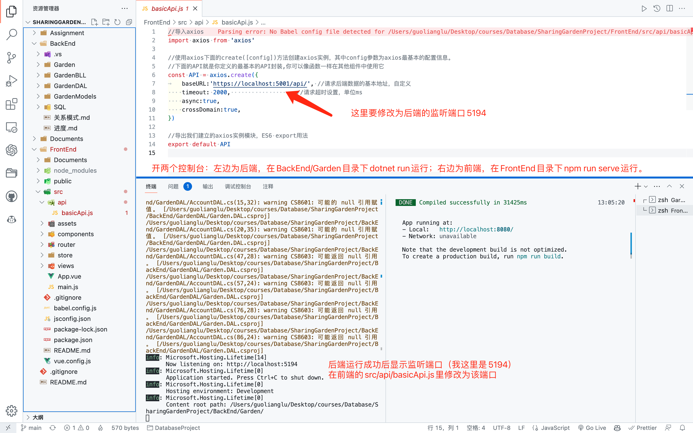

# 7.20更新

### 目前目录结构

```
.
├── BackEnd							# 后端
│   ├── Garden					# 启动项目
│   ├── GardenBLL				# Business Logic Layer业务逻辑层
│   ├── GardenDAL				# Data Access Layer数据访问层
│   ├── GardenModels		# 模型层
│   ├── SQL							# 数据库脚本
│   ├── 进度.md
│   └── 关系模式.md
├── FrontEnd						# 前端
│   ├── Documents
│   ├── README.md
│   ├── babel.config.js
│   ├── jsconfig.json
│   ├── node_modules
│   ├── package-lock.json
│   ├── package.json
│   ├── public
│   ├── src							# 主要开发代码
│   └── vue.config.js
├── Documents
└── README.md
```

### VSCode运行前后端方法

因为我的mac用不了VS，所以分享下用VSCode代替VS运行项目的方法。理论上只需要用到命令行，但VSCode整合了查看编写代码、Git功能、安装插件进行环境配置、代码调试和内置终端，极其方便。

（目前项目没连接上数据库，在那之后可能需要进一步配环境。但就前后端通信来说应该没问题。）

**后端环境**

Windows需要安装**.NET Core SDK**，macOS/Linux安装**.NET SDK和Mono**。安装方法上网查资料。

Windows终端dotnet --version输出版本号（我是6.0.301）即OK。非window还要查看csc（C#编译器）和mono（非Windows下.NET运行环境）是否安装成功。

**前端环境**

Node.js环境，前面说的很多了。

**运行**




### A组

- 王浩：**关于我们**、**反馈**两个前端页面
  - 无设计图，参考其他网站
  - 无数据请求，主要是关于我们里介绍下项目、开发团队，反馈给个表单就行不用考虑put数据，反正没人运维

- 周成杰：**数据通信**
  - 完成登录注册页面与后端连接，实现首次启动项目进入登录页面，输出正确账号密码后进主页
  - 在主页已有前端组件上写数据交换API demo，包括get、put、post各种可能遇到的场景（不止于演示，要考虑实际需求）


### B组

- 雷扬：个人主页资料部分
  - 新开一个view，做好从主页跳转来的router
  
  - 资料包括头像、头图、自述、用户名、用户ID、加入时间等等（详情见设计图）
  
  - 完成四个标签栏和点击标签进行页面更新，下面具体内容不负责（B组内部做好配合）
  
  - 编辑资料按钮，实现用户在该页面对自己资料的编辑（暂时前端写死数据，了解一些数据通信API，为后面写数据交换留好接口代码，最少要写好注释，方便其他同学加数据通信代码）
  
- 郭晓杰：个人主页标签栏 博客+花园+工作记录部分
  - 详情见页面设计

  - 博客部分的每个模块的代码可以直接用互动部分中**对他人博客点赞/评论**模块中的一部分，所以B组内部做好配合，不要出现重复工作、同一个东西不统一的情况

  - 花园部分参考花园展厅页面代码，基本上做好信息展示+跳转链接即可

  - 工作记录的设计比较简陋，可以自己发挥补充详细一点，只需要信息展示，没有额外功能

- 郑皓予：个人主页标签栏 互动部分
  - 包括了4种模块，对他人花园/博客的点赞/评论，因为博客部分需要用到部分代码，因此要早点做完配合队友

  - 需要实现链接功能，如头像用户名链接到用户主页、花园模块链接到花园单独页面、博客模块链接到博客页面

- 朱开来：博客页面
  - 不同于个人主页的新页面，需要单开一个view，因此需要单独行动
  - 具体排版设计看手绘图，可以参考知乎
  - 该做成链接和按钮的要用相应组件，如头像用户名链接到用户主页，赞同按钮可以点击且有效
  - 发布评论功能暂时不实现（学有余力可以自行设计实现完成这个页面）


### C组

- 数据库中添加花园和博客两个主要entity的数据，并在后端实现对它们的数据访问
  - **现有数据库设计可能没有涵盖所有可能的数据请求，实现过程中看情况添加satellite data**

- 花园的数据请求看页面设计3-花园展厅1～4，考虑主页的预览和花园展厅页面的具体信息展示，完成对应的数据访问
- 博客的数据请求看1-主页-2的预览、5-博客页面-1～2的具体信息展示，完成对应的数据访问
- 前后端数据通信的相关问题和**周成杰**讨论配合


## DDL：7.25