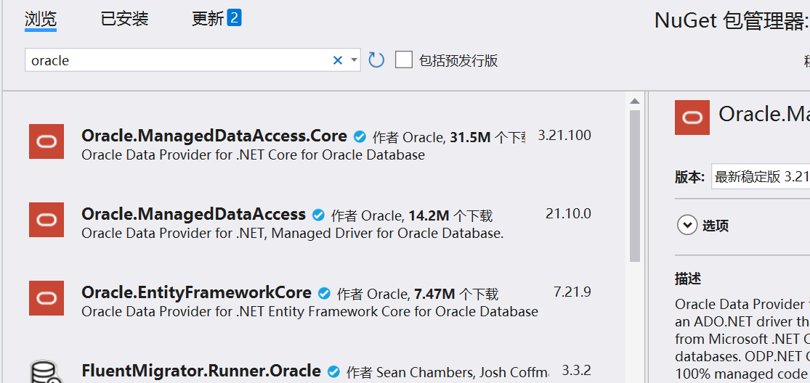

# .NET学习(2)

## ASP.NET Core Web API连接Oracle数据库

在NuGet包管理器中找到`Oracle.ManagedDataAccess.Core`并安装：



首先，在`appsettings.json`中配置好数据库连接字符串(把`your_id`和`your_pwd`替换为自己的用户ID和密码)：

```json
"ConnectionStrings": {
    "OracleConnection": "Data Source=localhost:1521/orcl;User Id=your_id;Password=your_pwd;",
},
```

在要用到数据库的控制器文件中添加以下命名空间引用：

```c#
using Oracle.ManagedDataAccess.Client;
```

在要用的Controller类中定义一个私有的IConfiguration字段，并在构造函数中进行注入：

```c#
private readonly IConfiguration _configuration;
public LoginController(IConfiguration configuration)
{
    _configuration = configuration;
}
```

例如，要获取student表中第一个名字，可以这样写(也可以不用using语句，但需要在取完数据后关闭连接)：

```csharp
[HttpGet]
public string GetName()
{
    string connectionString = _configuration.GetConnectionString("OracleConnection");

    using (OracleConnection conn = new OracleConnection(connectionString))
    {
        conn.Open();
        using (OracleCommand cmd = new OracleCommand("SELECT * from student", conn))
        {
            OracleDataAdapter adapter = new OracleDataAdapter(cmd);
            DataSet ds = new DataSet();
            adapter.Fill(ds);
            DataTable res = ds.Tables[0];
            DataRow dr = res.Rows[0];
            //conn.Close();
            var value = dr["name"].ToString();
            return value;
        }
    }
}
```

实例化连接对象→打开连接→实例化command→创建DataSet对象→实例化adapter→将查询结果填充到adapter中→操作→关闭连接

- 实例化command可以不做，用string即可：

  ```c#
  string sql = "SELECT * from student";
  OracleDataAdapter adapter = new OracleDataAdapter(sql, conn);
  ```

- DataAdapter有Fill和Update两个有用的方法。Fill将数据库中数据运到C#空间并填充DataSet，Update将C#中修改的内容逐行同步到数据库中

在Swagger中找到对应项，Try it out→Execute，可以看到结果是第一个学生的名字，查询成功。

#### 如何解决SQL注入问题

使用OracleParamter插入的方式：

```c#
string sql = "SELECT count(*) FROM account WHERE account_id=:param1 AND password=:param2"
```

```c#
OracleParameter[] oracleParameters = new OracleParameter[]
{
    new OracleParameter("param1", OracleDbType.Varchar2) {Value = inputAccountID},
    new OracleParameter("param2", OracleDbType.Varchar2) {Value = inputPwd}
};
cmd.Parameters.AddRange(oracleParameters);
```

在Oracle中以冒号标记占位符（SqlServer用@标记），插入时要注意数据类型和引号等问题。

#### 简单封装和登录实现

将连接数据库功能封装入OracleHelper类中：

```csharp
public class OracleHelper
{
    public static string connectionString = "...;"; //换成数据库访问字段
    public static int ExecuteScalar(string cmdText, params OracleParameter[] oracleParameters)
    {
        using OracleConnection conn = new OracleConnection(connectionString);
        conn.Open();
        using OracleCommand cmd = new OracleCommand(cmdText, conn);
        cmd.Parameters.AddRange(oracleParameters);
        return Convert.ToInt32(cmd.ExecuteScalar());
    } 
}
```

简单的登录功能实现如下：

```c#
[HttpGet]
public string Login(string accountID, string password)
{
    try
    {
        string sql = "SELECT COUNT(*) FROM student WHERE name=:param1 AND dept_name=:param2";
        OracleParameter[] oracleParameters = new OracleParameter[]
        {
            new OracleParameter("param1", OracleDbType.Varchar2) {Value = accountID},
            new OracleParameter("param2", OracleDbType.Varchar2) {Value = password}
        };
        if(OracleHelper.ExecuteScalar(sql, oracleParameters) > 0)
        {
            return "登录成功！";
        }
        else
        {
            return "用户名或密码错误！";
        }
    }
    catch (Exception ex)
    {
        return ex.Message;
    }
}
```

