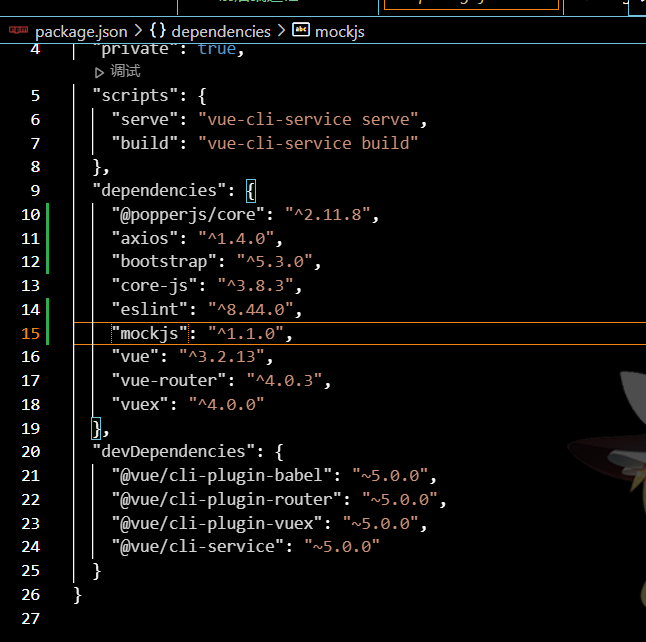
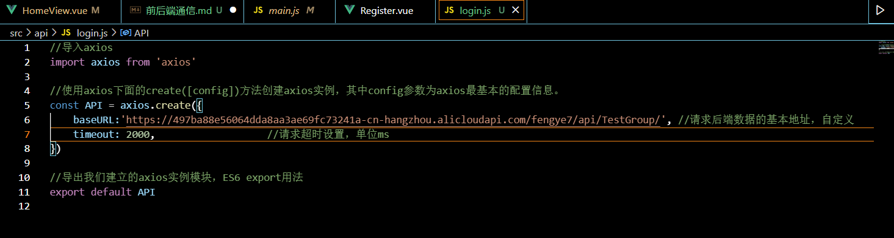
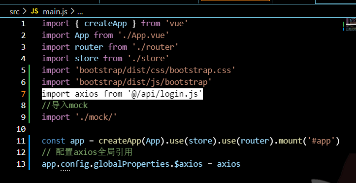
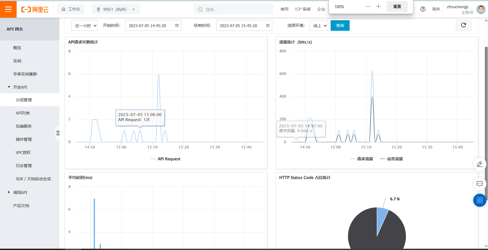
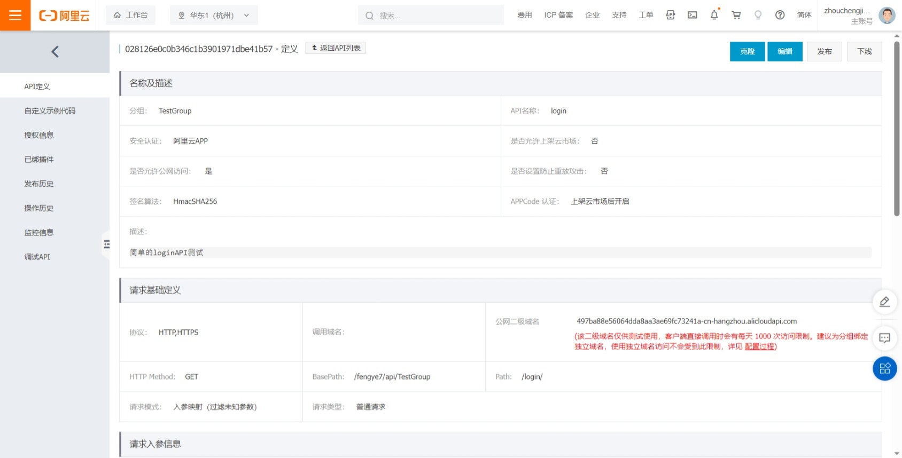
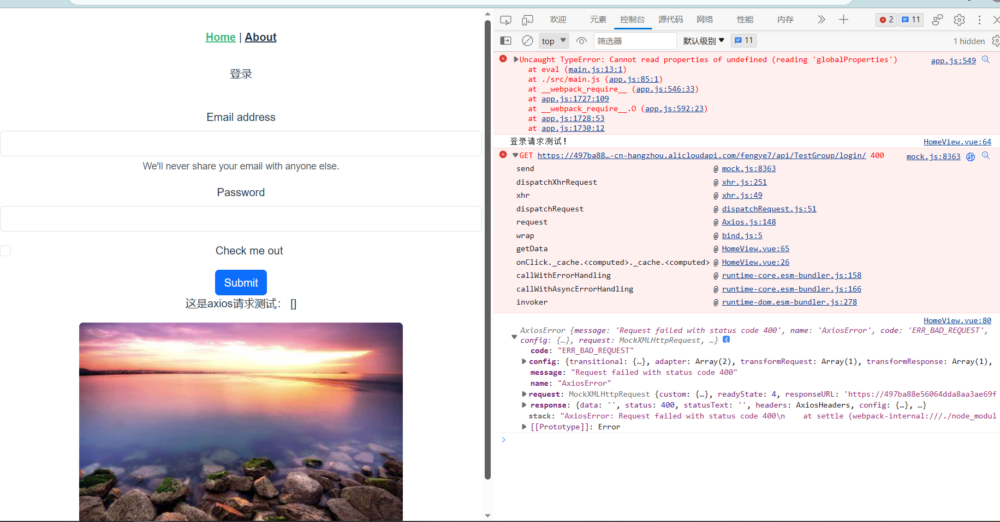

# 前后端通信
>本文档简单介绍我目前研究的两种通信方式，大家可以简单了解后我们选择一下。
>> * 第一种：选择第三方的API平台，我们通过在API平台上部署和链接，可以直接在第三方上定义接口参数，第三方管理数据（**这种方式也许编码量会少，但是整体的请求格式、数据库连接会相对复杂**）
>> * 第二种：选择ASP.NET Core框架，这是安装VS的NET开发后应该就会支持的，使用一些内置的类来编写自己的API控制器，然后在后端通过一些开源库连接Oracle（**这种方式相当于API的构建全部在后端，API设计等会更灵活，连接也更方便**）

* ## 首先确定的一件事
  我们从前端 发起请求选用的是axios，该方式的基本使用方式组长之前给的前端视频里有，看分集里面有axios：[这里再放一下](https://www.bilibili.com/video/BV12J411m7MG/?buvid=ZD4F8DD83E86CE2644ABBE3593FFCF5A1909&is_story_h5=false&mid=iHGpA9dZaN8UrNQ6jGJbMQ%3D%3D&p=1&plat_id=116&share_from=ugc&share_medium=iphone&share_plat=ios&share_session_id=B8F3AF1A-D8FC-481B-BAD7-3138684A1817&share_source=COPY&share_tag=s_i&timestamp=1688353959&unique_k=5yVIuHs&up_id=37974444)

  基本的形式是：
  ```{javascript}
        axios.post('http://8.136.17.54:6001/api/login/customer', params).then(function (response) {
        console.log(response);//请求正确时执行的代码
        let all = document.cookie
        console.log(all)
      }).catch(function (response) {
        console.log(response);//发生错误时执行的代码
      }) 
    ```   
上述代码中axios发出post请求，括号内是请求地址和参数，后面的then()放响应函数成功，后面catch()放响应失败。

> 简单提一下axios的环境配置，在vue应用教程中提到的vue项目管理器,在其中的项目依赖中下载axios，成功下载的话你会在项目的配置文件 **package.json** 中看到它：
然后你需要在main.js(vue项目的入口)中引入自己的api脚本文件：



我自己的请求案例：
```{javascript}
    //测试请求方法
    const getData = function () {
      console.log("登录请求测试！");
      API({
        url: "/login/",
        method: "get",
        headers: {
          "Content-Type": "application/json", // 请求内容类型
          Authorization: "APPCODE {12345678}", // 授权码，替换为你的APPCODE
        },
        params: "",
      }).then(
        function (res) {
          alert("请求成功!");
          testData.list = res.data.dataList;
          console.log(res.data);
        },
        function (err) {
          console.log(err);
        }
      );
    };
```

* ## 这里顺便提一下，mock接口测试
导入项目依赖的过程和上面差不多，这里有一个教程，简单的mock测试：[链接](https://blog.csdn.net/qq_43647821/article/details/123127824)

* ## 看一下两种方式部署：
  1. 第三方（这里选择的是 阿里云）：
有一个简单的教程：[创建一个简易的API](https://developer.aliyun.com/article/1067438#:~:text=%E5%BC%80%E5%8F%91%E8%80%85%E5%AD%A6%E5%A0%82%E8%AF%BE%E7%A8%8B%E3%80%90%E9%98%BF%E9%87%8C%E4%BA%91%20API,%E7%BD%91%E5%85%B3%E4%BD%BF%E7%94%A8%E6%95%99%E7%A8%8B%3A%E5%88%9B%E5%BB%BA%E4%B8%80%E4%B8%AA%20API%E3%80%91%E5%AD%A6%E4%B9%A0%E7%AC%94%E8%AE%B0%EF%BC%8C%E4%B8%8E%E8%AF%BE%E7%A8%8B%E7%B4%A7%E5%AF%86%E8%81%94%E7%B3%BB%EF%BC%8C%E8%AE%A9%E7%94%A8%E6%88%B7%E5%BF%AB%E9%80%9F%E5%AD%A6%E4%B9%A0%E7%9F%A5%E8%AF%86%E3%80%82%20%E8%AF%BE%E7%A8%8B%E5%9C%B0%E5%9D%80%EF%BC%9Ahttps%3A%2F%2Fdeveloper.aliyun.com%2Flearning%2Fcourse%2F406%2Fdetail%2F5236)

   这是平台上监测API调用情况的界面
   
   
   这是我创建的demo的API基本设置
   
   
   ps:我测试时由于请求参数的设置问题连不上，暂未看过其他的API服务平台:
   error 400 就是参数出了问题
   

2. ASP.NETCcore框架：
举一个前人的项目例子：（代码中的注释是基本理解）
* 后端的API控制器定义：
```{C#}
using Microsoft.AspNetCore.Mvc;
using System;
using System.Collections.Generic;
using System.Linq;
using System.Threading.Tasks;
using System.Collections.Specialized;
using Back_End.Contexts;
using Back_End.Models;
using System.Text.Json;
using Microsoft.AspNetCore.Http;
//上面的是用到的库

namespace Back_End.Controllers //这个是C#的名空间语法
{
    [ApiController] //控制器类前置声明
    [Route("api/[controller]")] /* 路由:用于前端的axios请求，不用考虑前面的网域和协议问题（ASP.NET Core会默认网域），[controller]表示缺省，匹配时自动换为控制类的名称（ ## 注意：要求 控制类的名称有固定后缀Controller, 缺省匹配时会忽略这个后缀） */
    public class LoginController : ControllerBase
    {
        [HttpPost("customer")] //这是一个路由会接上面的控制器的路由，该函数就是一个后端数据的处理函数，## 这里的处理逻辑需要后端同学教一下
        public string CuntomerLoginByPhone()
        {
            LoginMessage loginMessage = new LoginMessage();
            string phone = Request.Form["phonenumber"]; //接受 Form 提交的数据
            string password = Request.Form["password"];
            string preNumber = Request.Form["prenumber"];
            if (phone != null && password != null && preNumber != null)
            {
                loginMessage.errorCode = 200;
            }
            Customer customer = CustomerController.SearchByPhone(phone, preNumber);
            if (CustomerController.CustomerLogin(customer, password))
            {
                loginMessage.data["loginState"] = true;
                loginMessage.data["userName"] = customer.CustomerName;
                loginMessage.data["userAvatar"] = customer.CustomerPhoto;

                var token = Token.GetToken(new TokenInfo()
                {
                    id = customer.CustomerId.ToString(),
                    phone = phone,
                    password = password,
                    preNumber = preNumber,
                });
                loginMessage.data.Add("token", token);
                //Response.Headers.Add("Access-Control-Expose-Headers", "Token");
                //Response.Headers.Add("Token", token);
                //Response.Cookies.Append("Token", token, new CookieOptions() { Path = "/", HttpOnly=true});
                CookieOptions cookieOptions = new CookieOptions();
                cookieOptions.Path = "/";
                cookieOptions.HttpOnly = false;
                cookieOptions.SameSite = SameSiteMode.None;
                cookieOptions.Secure = true;
                cookieOptions.MaxAge = new TimeSpan(0, 10, 0);
                Response.Cookies.Append("Token", token, cookieOptions);
            }
            var request = Request;
            return loginMessage.ReturnJson();
        }

    //代码太长，只截取一部分
```
* 对应的前端请求：
  ```{javascript}
  cookieTest(){
      //cookie test
      var params = new URLSearchParams();
      params.append('prenumber', '+86');       //你要传给后台的参数值 key/value
      params.append('phonenumber', '09876543210');
      params.append('password', 'ajttql');
      axios.post('http://8.136.17.54:6001/api/login/customer', params).then(function (response) {
        console.log(response);//请求正确时执行的代码
        let all = document.cookie
        console.log(all)
      }).catch(function (response) {
        console.log(response);//发生错误时执行的代码
      })

      return;
    },
  ```
  上面的http://8.136.17.54:6001/就是ASP.NET Core自动部署的， 后面的api/login/customer就是按照上面提到的逻辑查询请求的