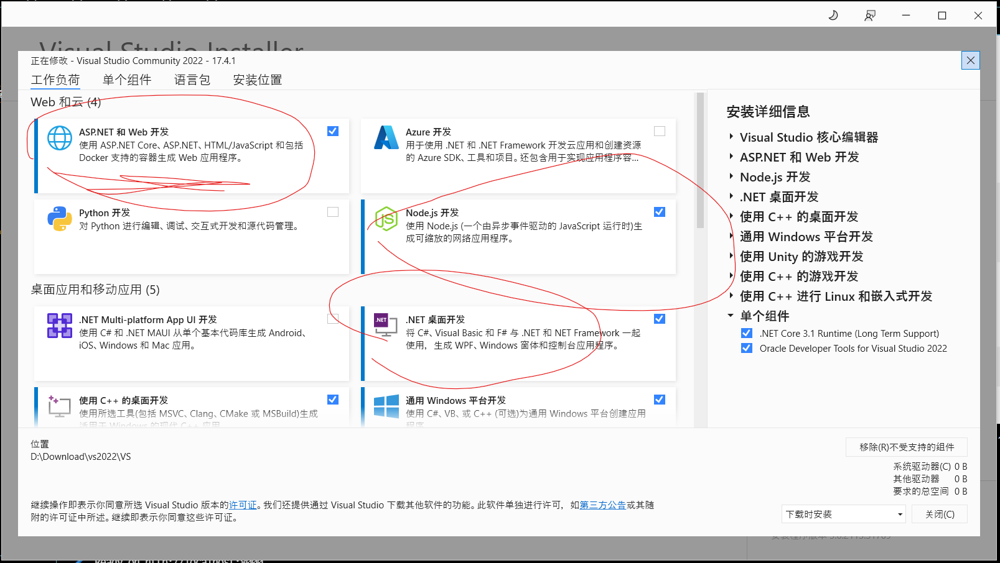
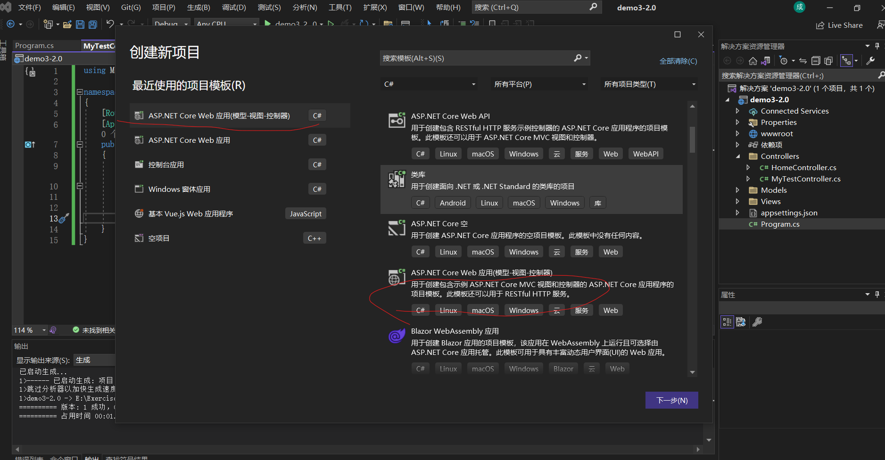
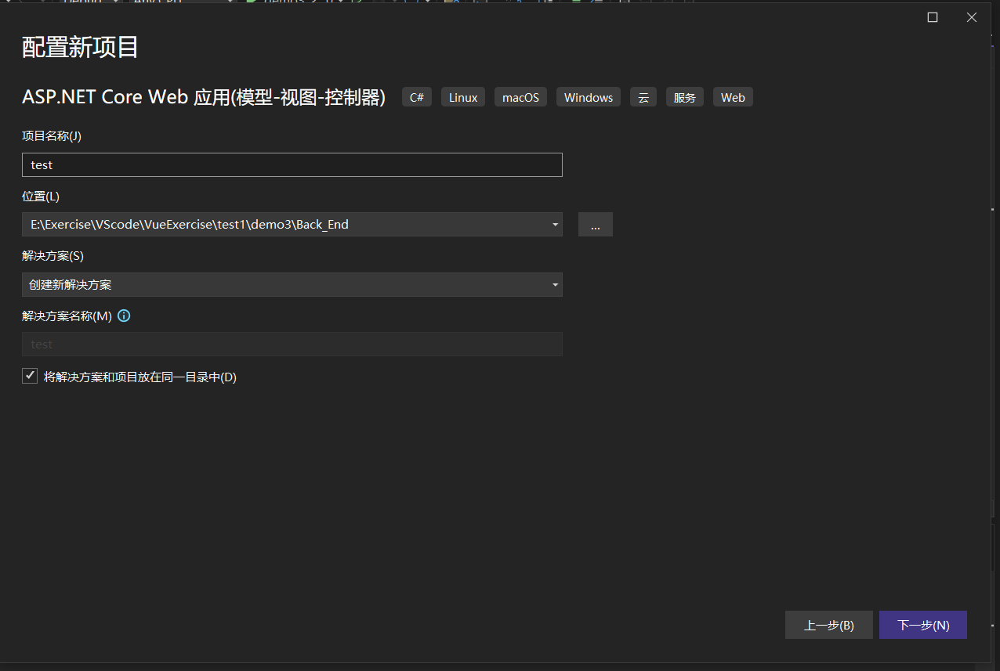
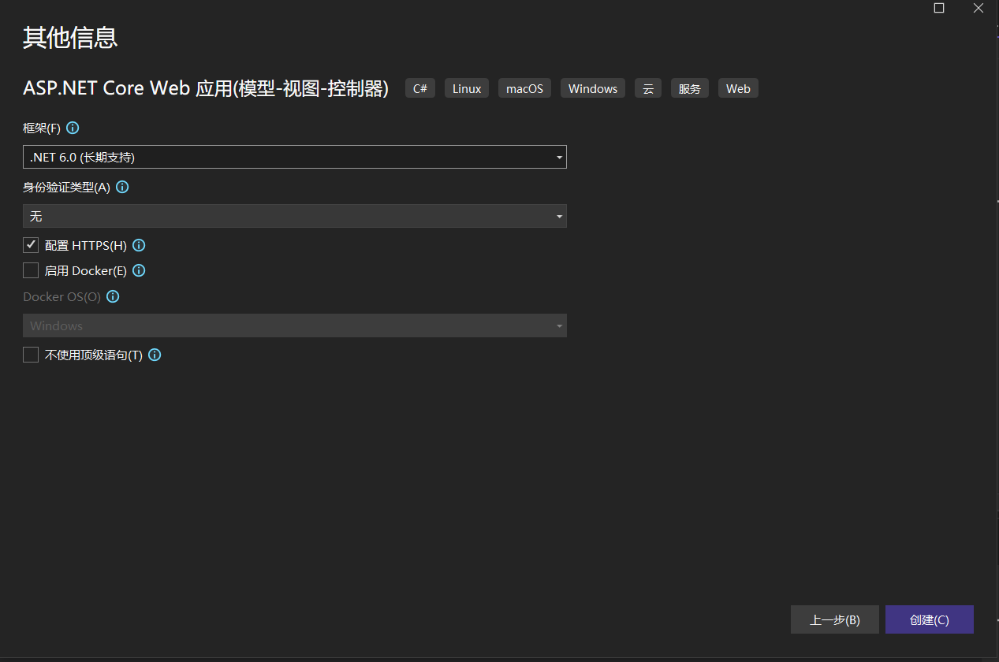
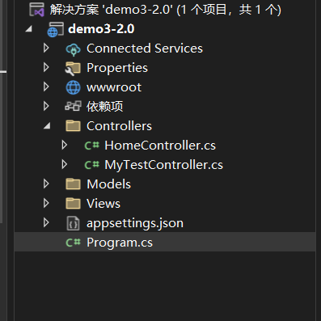
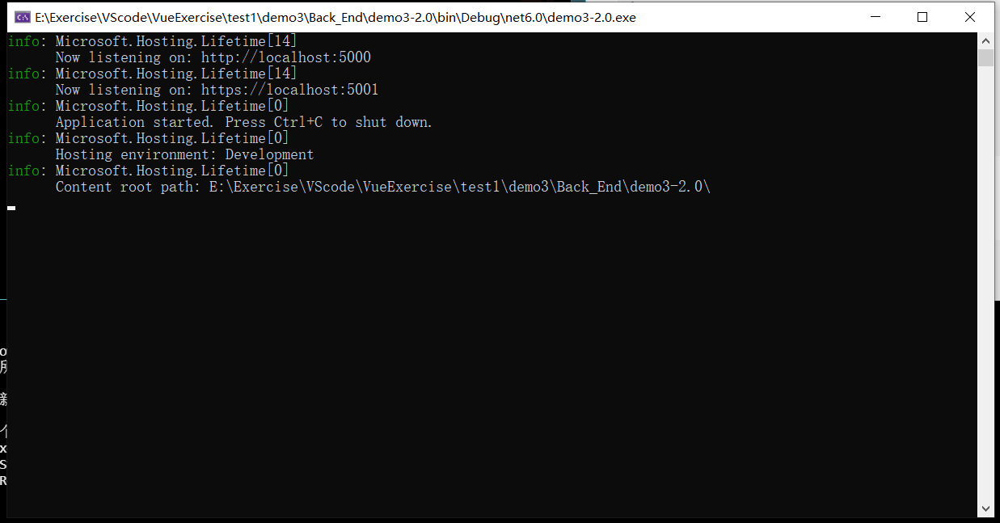
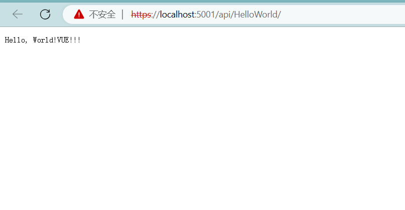
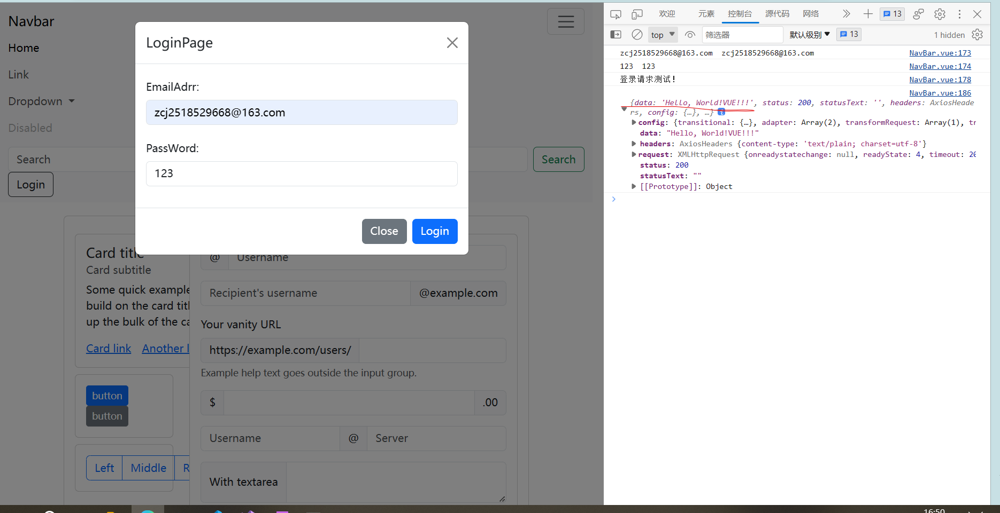

author: fengye7 2023-7-6

# 本文件将讲述我们实际开发时候的前后端通信
> 看过本文档我认为我们的实际开发就可以开始了，但主要是现在我们的没有数据库，我现在也还没在后端连上数据库试验过，仅实现了前后端实际的API部署和正确的通信，在我的后端**demo3-2.0**中，项目中提供连接数据库的功能，我想后端同学应该是没什么问题的

1. 项目准备：
   * 根据前面的vue教程部署好一个前端项目，这里不再赘述
   * 创建一个后端的项目：我这里是VS2022（这个应该是最方便的吧）
  > * 打开vs installer，选择修改：
  
  这里的“ASP.NET 和 Web开发”一定要有，node.js和.net桌面开发应该也需要，安装好后进入vs创建新项目，选择如下模板：
  
  项目名称等自己设置，我这里是test:
  
  选择下一步进入项目配置：
  
  像上面一样配置，**ps:1.启用Docker,应用部署时会变简单，但是我运行项目测试时运行不了，/Back_End/demo3中的就是启用了Docker的项目，有会的同学可以教大家 2.顶级语句eg: var name =一个字符串**
  > 最后点击创建,项目结构如下：
  
  **ps:views正常来讲要放前端的，我们这里不用，删掉即可; Controller中放你的API控制器，Models中放自己的类，Program.cs是该项目的入口**

  2. 项目例子：
   > 7-5我更新的:github上的——Documents/说明文档/vue前后端通信.md上讲了基本的API控制器写法，这里不再赘述，下面是我本次测试的API接口(demo3-2.0中的)：
   
```{c#}
using Microsoft.AspNetCore.Mvc;

namespace MyWebApi.Controllers
{
[Route("api/[controller]")]
[ApiController]
public class HelloWorldController : ControllerBase
{
[HttpGet]
public ActionResult<string> Get()
{
return "Hello, World!VUE!!!";
}
}
}
```
你需要在本地运行你的后端项目：
如上图表示成功，上面这个接口（https://localhost:5001
）只能在本机的浏览器访问，后面实现需要另外的部署。浏览器中的效果如下表示接口有用：
前端调用（7-5的文档讲过了）：
```{javascript}
      API({
        url: "/HelloWorld/",
        method: "get",
        params: null,
      }).then(
        function (res) {
          alert("请求成功!");
          console.log(res);
        },
        function (err) {
          console.log(err);
        }
      );
```
调用成功后实际效果图,红线是返回的数据：
