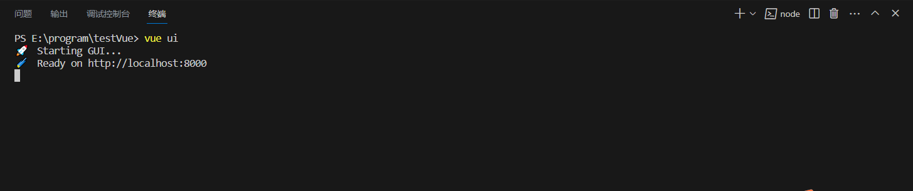
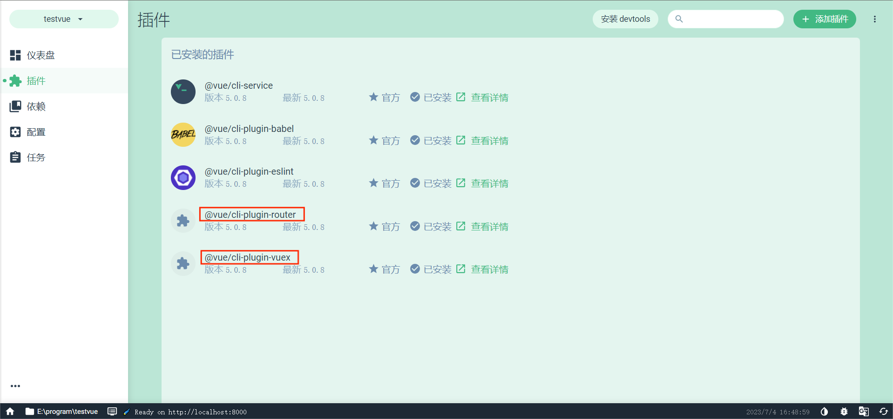
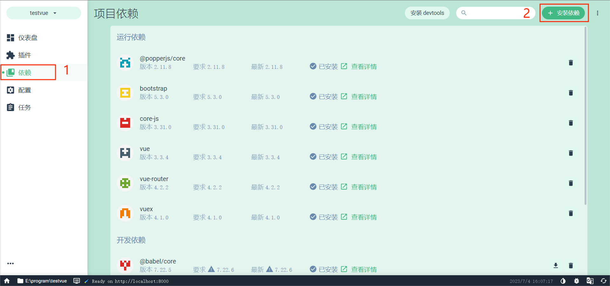
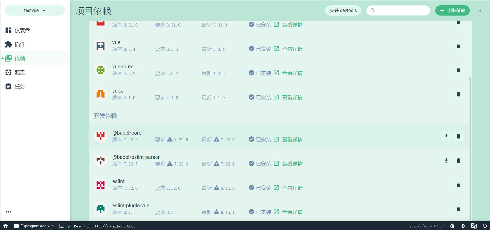
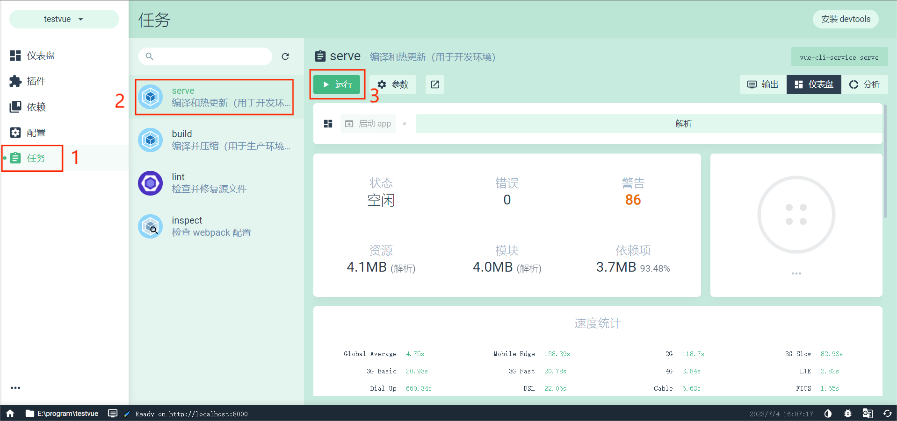
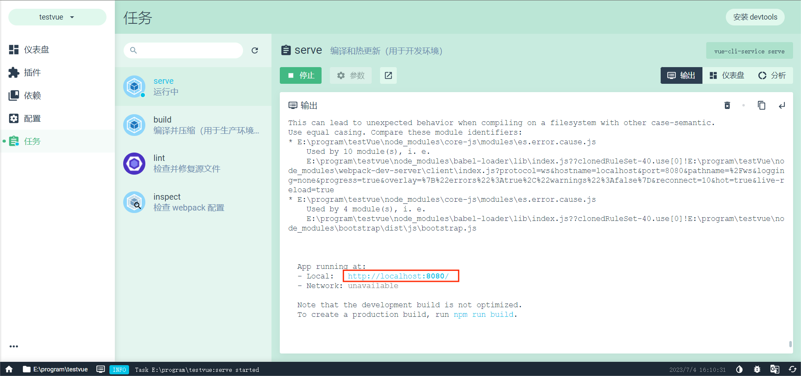

# 使用项目仪表盘管理项目

相比于命令行方式，图形化界面管理项目更加简单、友好。

这里仅介绍对已有项目的管理，不赘述创建新的项目(也很简单，可自行搜索学习)。

## 1. 打开项目仪表盘

进入本地vue项目的工作目录，执行 `vue ui`

浏览器打开项目仪表盘

## 2. 插件

安装必要的插件

**router：**

`vue`的单页面应用是基于路由和组件的，路由用于设定访问路径，并将路径和组件映射起来。

在`vue-router`单页面应用中，通过路径之间的切换，也就是组件的切换，来实现页面切换和跳转。

**vuex：**

管理组件之间通信

## 3. 依赖

安装必要的依赖

设计前端页面时，可以直接从[bootstrap](https://getbootstrap.com/docs/5.3/getting-started/introduction/)工具包中搜索组件，选择较为美观的组件，复制其代码并修改。

## 4. 编译和热更新

在项目仪表盘中选择 `任务` -> `serve` -> `运行`

在 `输出` 中查看日志

成功运行后，对本地项目的更改会实时反应在 `http://localhost:8080/` 页面