## 使用项目仪表盘创建一个vue项目

#### 1. 创建项目

在终端中执行 `vue ui`

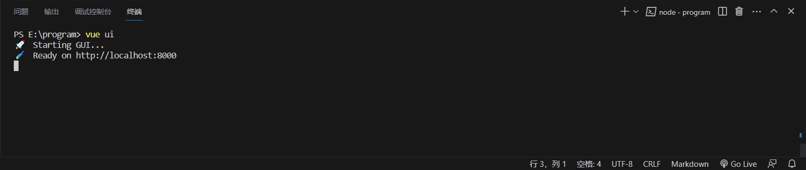

打开项目仪表盘

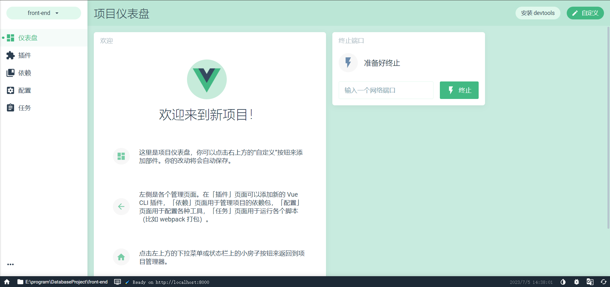

打开项目管理器

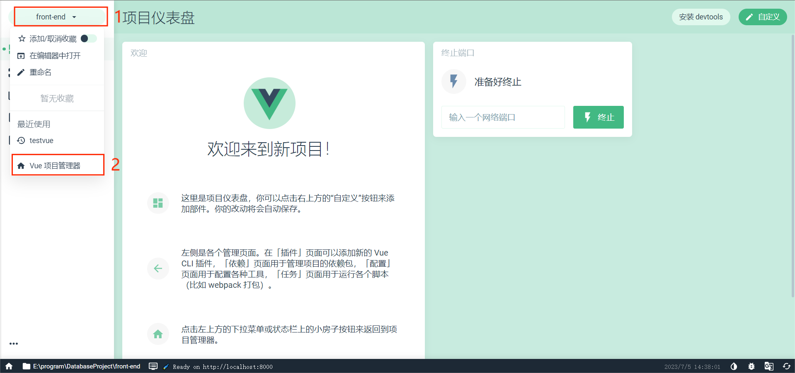

新建项目

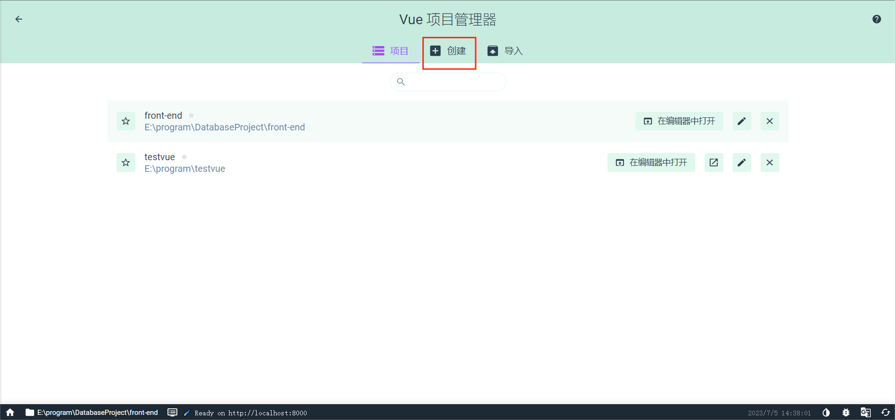

填写相关配置信息

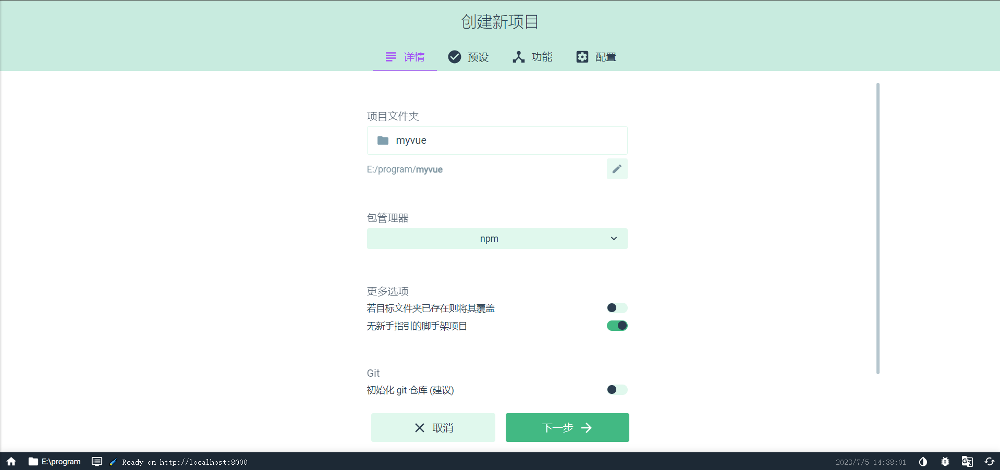

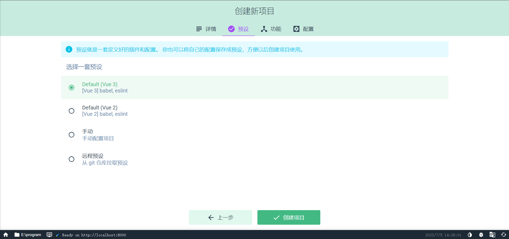

#### 2. 项目配置

安装插件 `vue-router` 和 `vuex`

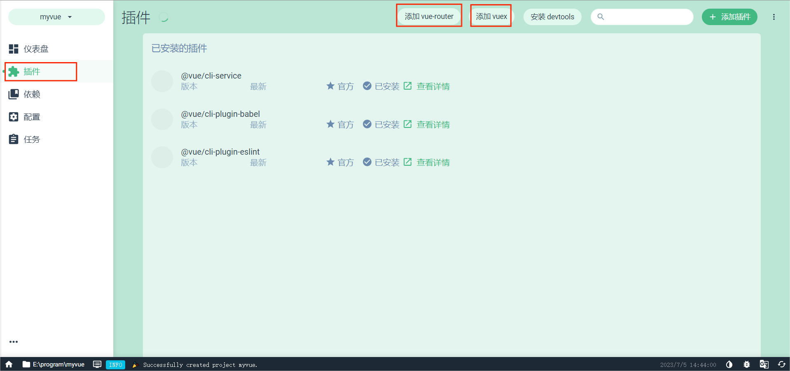

安装依赖 `bootstrap` 和 `@popperjs/core`

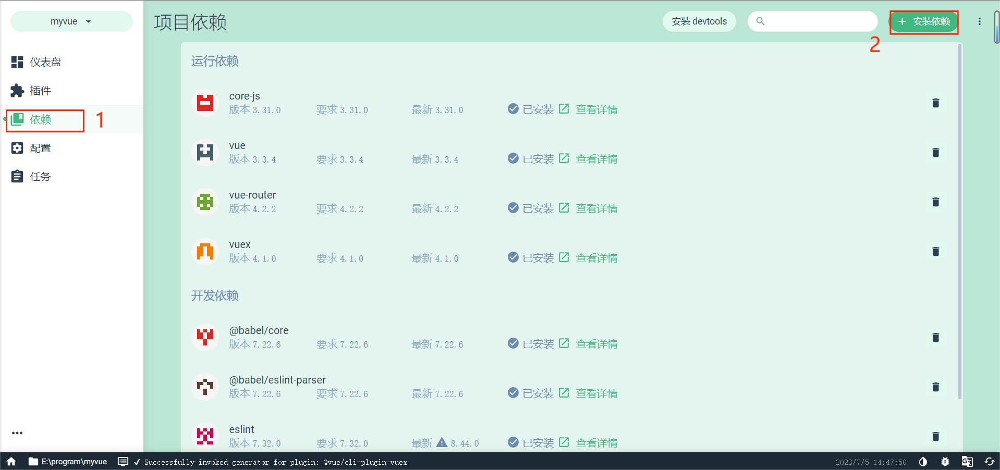

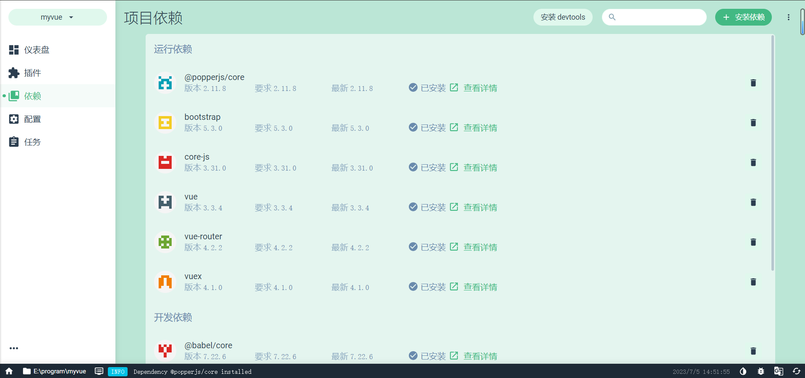

#### 3. 运行项目

在项目仪表盘中选择 `任务` -> `serve` -> `运行`

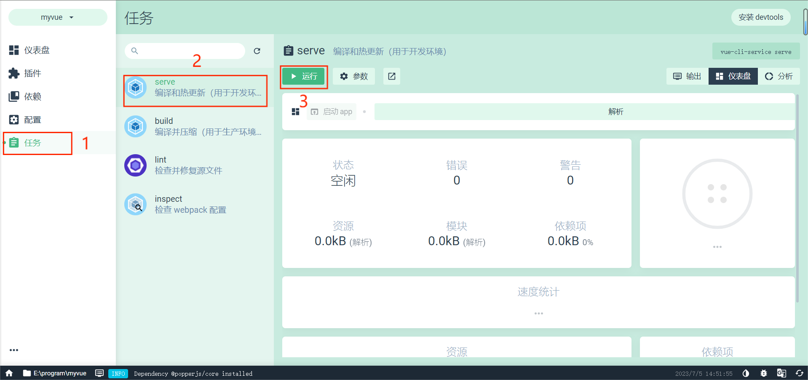

在 `输出` 中查看日志

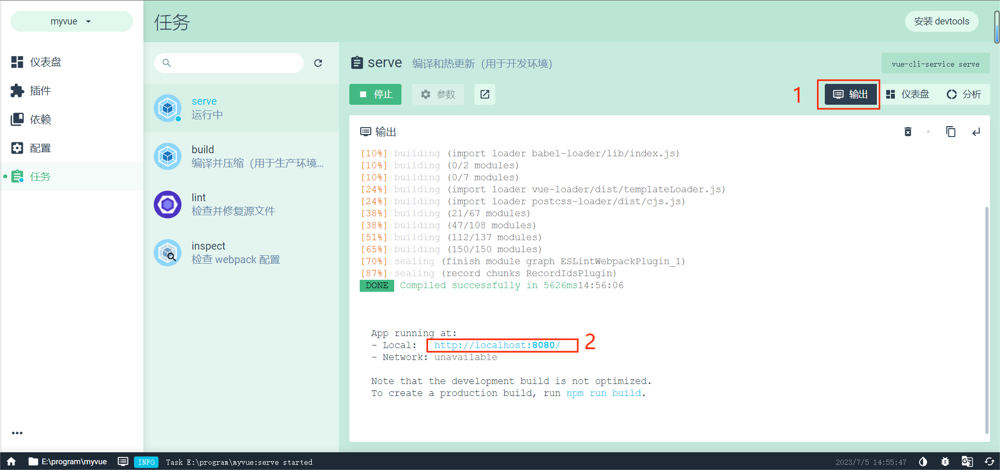

打开 `http://39.106.47.60:8080/` 网址，可以看到默认的页面

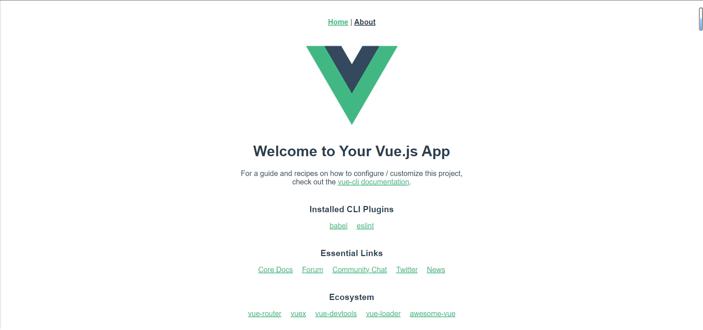

## Demo 网页

#### 1. 运行 Demo

在终端中终止项目(`Ctrl + c`)

用 `DatabaseProject\FrontEnd\src_demo` 文件夹替换项目默认生成的 `src` 文件夹并重命名为 `src`

重新启动项目仪表盘，打开之前的项目并运行，即可看到 `demo`

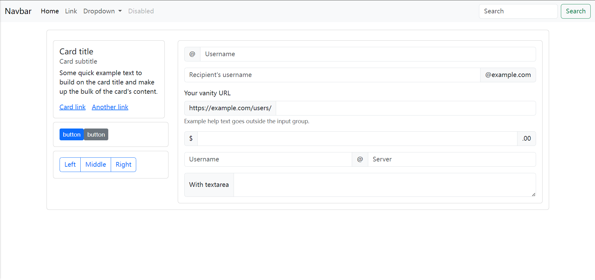

#### 2. `src` 文件夹结构：

```txt
├── assets      # 资源文件夹
│   ├── ...
│   └── ...
├── components  # 组件文件夹
│   ├── ...
│   └── ...
├── router      # 路由文件夹
│   ├── ...
│   └── ...
├── store       # 状态管理文件夹
│   ├── ...
│   └── ...
├── views       # 视图文件夹
│   ├── ...
│   └── ...
├── App.vue     # Vue应用程序的根组件
└── main.js     # Vue应用程序的入口文件
```

#### 3. 各部分的功能说明：

**assets：**

这个文件夹通常用于存放项目所需的静态资源，如图像、字体、样式表等。这些资源可以在Vue组件中通过相对路径进行引用和使用。

**components：**

这个文件夹用于存放Vue组件，每个组件通常包含了自己的模板、样式和逻辑。这些组件可以在项目中的不同视图（views）中进行复用，帮助实现组件化开发和代码重用。

**router：**

这个文件夹通常用于存放Vue Router的相关配置文件。Vue Router是Vue.js官方的路由管理器，用于实现单页应用中的路由功能，包括定义路由路径、加载对应的组件等。

**store：**

这个文件夹通常用于存放Vuex的相关配置文件。Vuex是Vue.js官方提供的状态管理模式，用于集中管理应用程序的状态，包括状态的存储、修改和响应等。

**views：**

这个文件夹通常用于存放项目的不同视图文件，每个视图对应着应用程序中的一个页面或页面的一部分。视图文件通常由多个组件组成，用于展示特定的内容和处理与该视图相关的逻辑。

**App.vue**

它是一个单文件组件（Single File Component），包含了模板、样式和逻辑，用于定义应用程序的整体结构和布局。App.vue可以包含其他子组件，并通过Vue Router来管理不同视图之间的切换。通常，你可以在App.vue中设置全局的样式、布局和共享的状态，以及处理整个应用程序的生命周期钩子函数。

**main.js**

它是整个应用程序的起点，在这个文件中进行了Vue框架的初始化和配置。在main.js中，你会引入Vue框架和其他必要的依赖，创建Vue实例，并将根组件App.vue注册到Vue实例中，最终将Vue实例挂载到HTML文档的某个DOM元素上。此外，你还可以在main.js中配置一些全局设置，如路由器（Vue Router）、状态管理器（Vuex）和其他插件。

## 前端开发

#### 1. 添加页面

如果要给前端增加一个页面，步骤如下：

在 `src/views` 文件夹下新建 `xxxView.vue` 文件，并编写其内容。

空白页面模板如下：

```html
<template>
  <ContentBase>
    <!-- 这里放页面的内容 -->
  </ContentBase>
</template>

<script>
import ContentBase from '../components/ContentBase.vue';  // 导入组件

export default {
  name: 'xxxView',  // 给这个页面命名
  components: {
    ContentBase,  // 这里放页面用到的所有组件
  }
}
</script>

<style scoped>
    /* 这里可以调整<template>里的组件的样式 */
</style>
```

在 `src/router/index.js` 文件中添加

```js
import xxxView from '../views/xxxView.vue'
```

在这个文件的 `const routes` 数组中添加一项(注意数组元素间要有 `,`)：

```js
{
    path: '/xxx',
    name: 'xxx',  // router-link 要使用的页面名称
    component: xxxView
}
```

在 `src/components/NavBar.vue` 中为组件添加链接即可实现页面跳转，例如：

```html
<router-link class="yyy" :to="{ name: 'xxx' }">导航栏项显示的内容</router-link>
```

#### 2. 添加组件

简单的控件或不会复用的控件可以直接写在页面文件里

内容复杂或需要重复使用的控件最好以 `xxx.vue` 文件的形式，写在 `src/components` 目录下，以便不同页面、不同位置多次使用。

如果要给前端增加一个控件，步骤如下：

在 `src/components` 文件夹下新建 `xxxxxx.vue` 文件，并编写其内容。

空白控件模板如下：

```html
<template>
    <!-- 这里放控件内容 -->
</template>
  
<script>
export default {
    name: "xxx",
}
</script>
  
<style scoped></style>
```

如果一个页面要使用写好的 `xxx` 控件，在该页面的 `<script>` 部分

```js
import xxx from '../components/xxx.vue';

export default {
    name: 'yyyView',
    components: {
        ContentBase,
        xxx
    }
}
```

#### 3. 使用 `bootstrap`

由于项目安装了 `bootstrap` 依赖

并且在 `src/main.js` 中：

```js
import 'bootstrap/dist/css/bootstrap.css'
import 'bootstrap/dist/js/bootstrap'
```

可以直接从 [这里](https://getbootstrap.com/docs/5.3/getting-started/introduction/) 搜索需要的组件，复制其代码到项目中，根据需要调整即可，无需全部手写。
